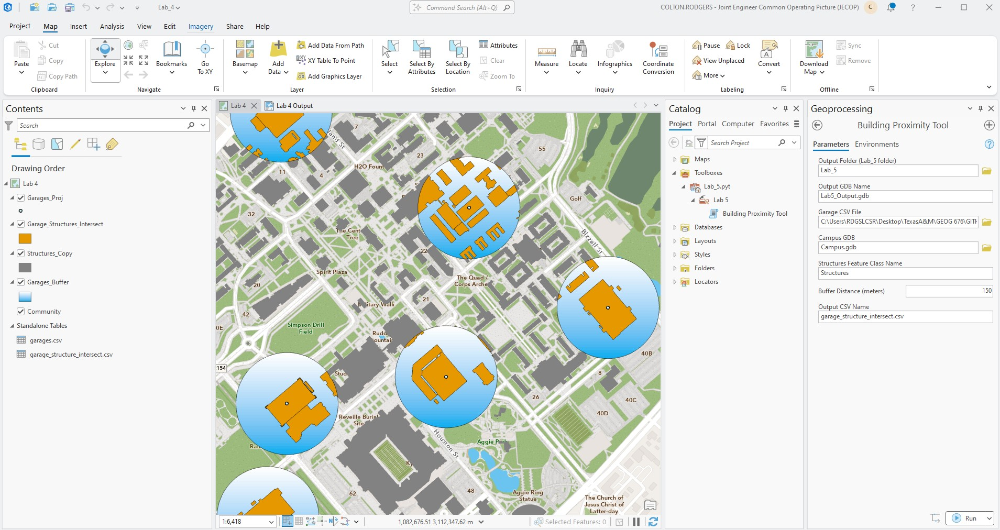

# Lab 5

Topic: Creating a toolbox

Outcomes:
- Learn how to perform some advanced spatial analysis (e.g. Clip, Dissolve, Union) using python code.
- Understand the tool making process and create a basic arcpy-based tool.
- Learn how to create a ArcGIS toolbox with your tool.
- Learn what cursors are and when and how you would use them.

Task:
- Turn the script created for HW04 into a tool
- Add the tool into a toolbox

## Deliverables

- Link to your GitHub page that contains the Python code
- Screenshot of the tool you developed displayed in ArcGIS Pro

### ArcPro Toolbox

### ArcPro Verification

#### Outputs
- Lab5_Output.gdb
- garage_structure_intersect.csv
- Lab5.pyt